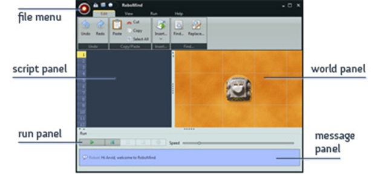
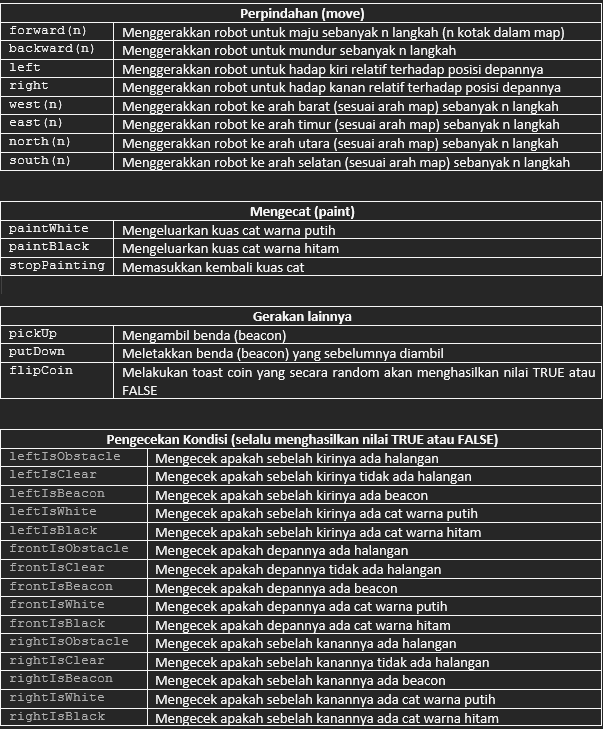

# Apa itu RoboMind?
RoboMind adalah lingkungan pemrograman interaktif untuk pemula yang dirancang untuk mengajarkan konsep dasar dalam pemrograman melalui visualisasi oleh robot yang akan melakukan apapun yang telah diinstruksikan.

Pada pertemuan ini kita akan melakukan pemrograman pada program RoboMind terlebih dahulu sebelum terjun langsung ke bahasa pemrograman asli. Fokus utama kita adalah bagaimana mengendalikan robot melalui instruksi yang tersedia sehingga robot dapat menyelesaikan misi yang diingkan oleh kita.

# Fitur dari RoboMind
Simulasi Robot: RoboMind menyediakan simulasi robot yang dapat digunakan untuk mengajar pemrograman dasar. Pengguna dapat mengendalikan robot virtual ini dan membuatnya menjalankan tugas-tugas sederhana.

Lingkungan Grafis: Lingkungan pengembangan RoboMind memiliki antarmuka grafis yang memungkinkan pengguna untuk secara visual mengatur dan mengontrol robot serta melihat hasil eksekusi program mereka.

Ketersediaan Gratis: RoboMind tersedia secara gratis untuk penggunaan pendidikan dan non-komersial. Ini membuatnya menjadi alat yang berguna untuk sekolah, guru, dan siswa yang ingin mempelajari pemrograman dan robotika tanpa biaya tambahan.

# Interface
.

Keterangan:
- **File menu** berisi submenu yang digunakan untuk pengaturan file, seperti membuat file baru, melakukan save atau save as file, dan juga membuka file
- **Script panel** merupakan area di mana kode program (kumpulan instruksi) dituliskan. Kode program yang ditulis inilah yang akan dijalankan untuk pengendalian robot
- **Run panel** berisi serangkaian tombol yang digunakan untuk mengeksekusi kode program yang telah dibuat, menghentikan proses eksekusi sementara (pause), atau menghentikan sepenuhnya, dan juga mereset eksekusi
- **World panel** merupakan area map yang akan dilalui oleh robot
- **Message panel** merupakan bagian dari interface yang nantinya akan memunculkan beberapa pesan seperti pesan kesalahan sintaks, atau pesan yang muncul dari robot dikarenakan ketidakmampuannya untuk menjalankan instruksi yang diberikan

# Instruksi
RoboMind memiliki beberapa instruksi yang dapat kita berikan. Berikut tabel dari instruksi yang ada:

# Latihan
Latihan akan diberikan saat praktikum nanti